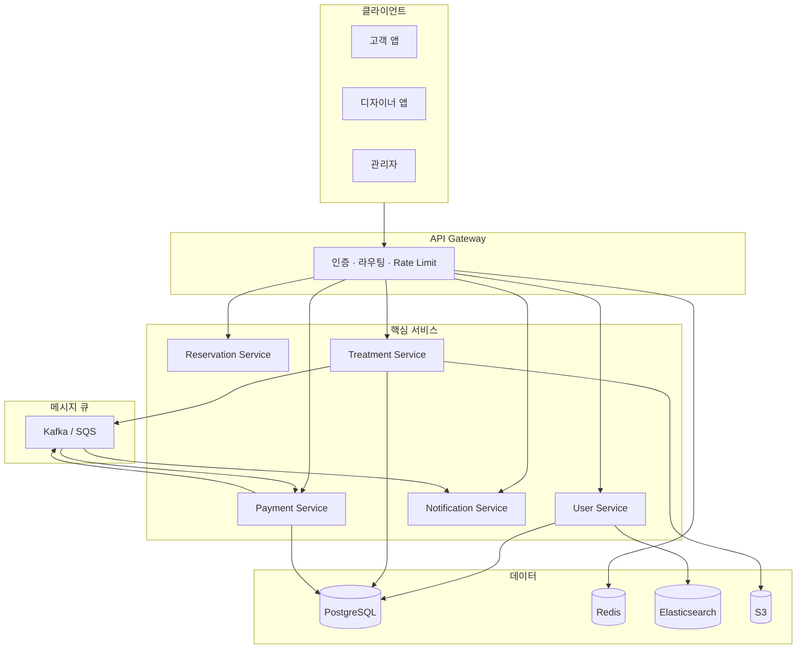
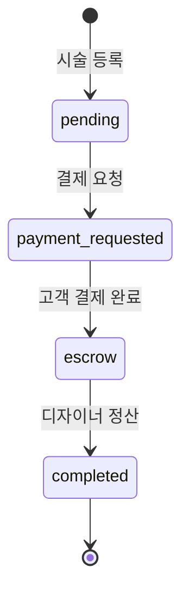

# 헤어 다이어리 — 전체 설계 (10M+ 사용자)

이 문서는 **1천만 명 → 1천만 명씩 증가**하는 규모를 전제로, 고객·디자이너의 **시술·결제·정산·이력**이 여러 화면에서 **같은 기준**으로 보이도록 구조를 정리합니다.

---

## 1. 설계 원칙

| 원칙 | 설명 |
|------|------|
| **단일 진실 원천** | 시술 `treatments` + 결제 `payments`는 DB에서 분리 저장하되, 앱·API는 **Treatment Ledger(시술 원장)** 하나로 묶어서 노출 |
| **화면은 뷰만** | 자산·매출·정산·프로필은 각각 다른 API를 중복 호출하지 않고, **같은 집계 모델**에서 파생 |
| **쓰기는 이벤트, 읽기는 최적화** | 결제/정산 완료는 메시지 큐로 비동기 처리, 통계·목록은 캐시·읽기 전용 DB |
| **역할별 경계** | 고객 앱 / 디자이너 앱 / 관리자는 같은 API Gateway, RLS·역할로 데이터 분리 |

---

## 2. 전체 레이어 (목표 인프라)



### 서비스 책임

| 서비스 | 담당 데이터 | 연동 화면 예 |
|--------|-------------|--------------|
| **User** | profiles, 관계, 초대 | 로그인, 프로필, 디자이너 검색 |
| **Treatment** | treatments, 사진, AI 인사이트 | 자산, 시술 입력, 다이어리 |
| **Payment** | payments, 정산, Toss | 결제, 영수증, 매출, 정산 |
| **Notification** | 알림, FCM | 알림함, 결제/정산 푸시 |
| **Reservation** | 예약·매칭 (확장) | 추후 예약 플로우 |

---

## 3. 도메인 모델 — Treatment Ledger (시술 원장)

복잡해 보이는 화면 연동을 **한 덩어리**로 단순화합니다.

```
TreatmentLedgerEntry
├── treatment      (시술 이력: 날짜, 고객, 시술명, 가격, payment_status …)
├── payment        (결제 행: amount, status, settled_at …) | null
├── paymentStatus  (화면용 통합 상태: pending → escrow → completed)
└── badge          (뱃지 문구·색)
```

- **쓰기**: `Payment Service`만 `payments` + `treatments.payment_status`를 **한 트랜잭션(또는 Saga)** 으로 갱신
- **읽기**: 디자이너는 `GET /designer/ledger` (또는 앱의 `fetchDesignerLedger`) 한 번으로 시술+결제 조인

### 상태 흐름



---

## 4. 클라이언트 구조 (현재 코드 기준)

```
lib/
├── domain/              # 순수 도메인 (UI·DB 무관)
│   └── treatment-ledger.ts
├── services/            # 화면 간 공유 오케스트레이션
│   ├── designer-ledger-service.ts   # 디자이너 시술+결제 일괄 로드
│   ├── customer-ledger-service.ts   # 고객 시술+결제 일괄 로드
│   ├── ledger-cache.ts              # 45초 메모리 캐시 + 무효화
│   └── ledger-invalidate.ts         # 시술 수정·결제 후 캐시 무효화
├── treatments.ts        # 시술 Repository (Supabase / Demo)
├── payment-record.ts    # 결제 Repository
├── payments.ts          # 결제·정산 유스케이스 (쓰기 후 캐시 무효화)
├── designer-revenue-analytics.ts   # Ledger → 매출 통계
├── designer-payment-stats.ts       # Ledger → 정산 통계
└── customer-invitations.ts         # Ledger 파생 예정: 고객 목록
```

### 화면 ↔ 데이터 매핑

| 화면 | 사용 API (목표) | 현재 |
|------|-----------------|------|
| 디자이너 자산 | Ledger + 초대 | `fetchDesignerLedger` → `getDesignerClientListItems` |
| 매출 분석 | Ledger → revenue analytics | `fetchDesignerLedger` → `fetchDesignerRevenueAnalytics` |
| 프로필 정산 | Ledger → payment stats | `fetchDesignerLedger` → `fetchDesignerProfilePaymentStats` |
| 고객 결제 목록 | Ledger (고객용) | `fetchCustomerLedger` → `fetchCustomerPaymentEntries` |
| 시술 상세 | 단건 treatment + payment | `getTreatmentById` |

**캐시 무효화**: `settleDesignerPayout`, `handleTossPaymentSuccess` 후 `invalidateDesignerLedgerCache(designerId)` 호출.

---

## 5. API 설계 (백엔드 확장 시)

Gateway 뒤 **BFF(Backend for Frontend)** 를 두면 앱은 화면별로 여러 번 부르지 않습니다.

| 엔드포인트 | 용도 |
|------------|------|
| `GET /v1/designer/ledger?month=2026-05` | 시술+결제+요약 (자산·매출 공통) |
| `GET /v1/designer/revenue?month=&week=` | 월/주 집계 (읽기 전용 replica) |
| `GET /v1/customer/ledger` | 고객 다이어리·결제 |
| `POST /v1/payments/settle` | 정산 → 큐 → 알림 |

### 이벤트 (메시지 큐)

| 이벤트 | 구독자 | 효과 |
|--------|--------|------|
| `payment.completed` | Notification, Analytics | 푸시, 매출 집계 갱신 |
| `settlement.completed` | Notification, Designer stats | 정산 완료 알림, 캐시 invalidation |

---

## 6. 데이터베이스 · 확장 (10M → 20M → …)

| 단계 | 사용자 | 전략 |
|------|--------|------|
| 1 | ~10M | PostgreSQL **읽기 replica**, Redis 세션·핫 목록, CDN(사진) |
| 2 | ~20M | `treatments` / `payments` **designer_id·customer_id 샤딩**, 파티션(월별) |
| 3 | ~30M+ | 검색 Elasticsearch, 글로벌 CDN, 서비스별 DB 분리 |

### 인덱스 (필수)

- `treatments(designer_id, treatment_date desc)`
- `treatments(customer_id, treatment_date desc)`
- `payments(designer_id, status, settled_at desc)`
- `payments(treatment_id)` UNIQUE

### 읽기 모델 (선택)

- `designer_revenue_monthly` — 월별 매출 materialized view (이미 SQL view 존재, 배치 갱신)
- `designer_client_summary` — 고객별 시술 건수·마지막 방문

---

## 7. 마이그레이션 로드맵

### Phase A — 지금 (모노리식 앱 + Supabase)

- [x] `TreatmentLedger` 도메인 타입
- [x] `fetchDesignerLedger` + 캐시
- [x] `fetchCustomerLedger` + 캐시
- [x] 매출·정산·프로필·자산이 Ledger 공유
- [x] 고객 결제 목록 N+1 제거
- [x] 홈·시술 상세 `useFocusEffect` + `invalidateLedgerCachesForTreatment`
- [ ] React Query 등 공통 fetch 훅 (선택)

### Phase B — API 분리 준비

- Repository 인터페이스 (`TreatmentRepository`, `PaymentRepository`)
- 환경변수로 REST base URL 전환

### Phase C — 10M 운영

- API Gateway + Treatment/Payment 서비스
- Kafka/SQS 정산·알림 비동기
- Redis + 읽기 replica

---

## 8. 개발 시 체크리스트

1. 새 화면에서 시술·결제를 **각각 직접 조합**하지 말고 Ledger(또는 전용 집계 API) 사용
2. `treatments.payment_status`와 `payments.status`를 **같은 유스케이스**에서만 수정 (`lib/payments.ts`)
3. 쓰기 후 `invalidateDesignerLedgerCache` (또는 서버 캐시 태그 purge)
4. 통계는 **시술일(treatment_date)** vs **정산일(settled_at)** 기준을 문서·UI 라벨에 명시

---

## 9. 참고

- DB 스키마: `supabase/schema.sql`
- 결제 플로우: `supabase/migrate_escrow_payment_flow.sql`
- 데모 대용량 시드: `lib/demo-accumulated-*` (메모리 전용, AsyncStorage 미저장)
